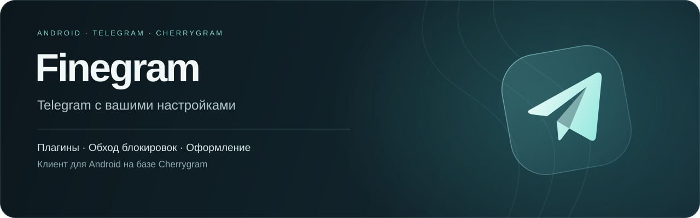

<p align="center">
  
</p>

<p align="center">
  <a href="https://t.me/th3nek1t_projects">Сборки и новости</a> ·
  <a href="#возможности">Возможности</a> ·
  <a href="#сборка">Сборка</a> ·
  <a href="#лицензия-и-авторы">Авторы и лицензия</a>
</p>

Finegram — клиент Telegram для Android на базе [Cherrygram](https://github.com/arsLan4k1390/Cherrygram). В нём доступны встроенный обход блокировок, плагины, сохранение удалённых сообщений и дополнительные настройки оформления и камеры.

Текущая версия базы — **Telegram 12.10.6**. Стабильные сборки публикуются в [канале проекта](https://t.me/th3nek1t_projects) и доступны через обновления клиента. Бета-версии проходят отдельное тестирование.

## Возможности

| Раздел | Возможности |
| :--- | :--- |
| Подключение | Встроенный обход через WebSocket, SOCKS5 и MTProto. VLESS и Hysteria2 на устройствах ARM64. |
| Плагины | Магазин, установка файлов плагинов, настройки и действия в меню чата. Совместимость с API exteraGram и установка Python-зависимостей. |
| Анонимность | Режим призрака, исключения для чатов, сохранение удалённых сообщений и журнал удалений по аккаунтам. |
| Оформление | Наборы значков `.icons`, переключатели Material 3, настройки папок и нижней панели, отдельные стили меню сообщений. |
| Музыка | Плеер с крупной обложкой, компактная панель управления и цвета текущей темы. |
| Сообщения | Локальное редактирование, удаление своих сообщений с фильтром по давности и отправка медиа из галереи как кружка. |
| Камера | Выбор движка, настройки записи звука, ручной выбор ID камер и панель объективов при записи кружков. |

Набор объективов и режимов камеры зависит от устройства. Некоторые плагины требуют библиотек с нативным кодом, для которых нет готовых сборок Android.

## Сборка

После клонирования загрузите закреплённые версии нативных зависимостей:

```bash
git submodule update --init --recursive
```

Для сборки нужны JDK 17, Android SDK 36, Build Tools 36.0.0, NDK 27.2.12479018, CMake 3.22.1 и Python 3.11.

Создайте `private.properties` в корне проекта:

```properties
TELEGRAM_API_ID=ваш_id
TELEGRAM_API_HASH=ваш_hash
```

Значения берутся в разделе API development tools на [my.telegram.org](https://my.telegram.org). Путь к SDK задаётся в `local.properties` или через `ANDROID_HOME`.

Для push уведомлений положите свой `google-services.json` в `TMessagesProj/` и `TMessagesProj_AppStandalone/`. Этот файл не добавляется в Git.

Для Google Maps задайте `GOOGLE_MAPS_API_KEY` через переменную окружения или `private.properties`. Ограничьте ключ пакетом приложения, сертификатом подписи и Maps SDK for Android. Без ключа карты Google недоступны.

Сборка APK:

```bash
./gradlew :TMessagesProj_AppStandalone:assembleAfatStandalone
```

APK появится в `TMessagesProj_AppStandalone/build/outputs/apk/afat/standalone/`.

Python-зависимости загружаются при сборке. Для сборки без доступа к индексам пакетов можно подготовить каталог `wheels/` в корне проекта с полным набором зависимостей для обеих архитектур. Если каталог отсутствует, используются настроенные индексы пакетов.

## Структура

| Каталог | Содержимое |
| :--- | :--- |
| `TMessagesProj/src/main/java/com/th3nekit/finegram` | Код Finegram |
| `TMessagesProj/src/main/python` | Среда плагинов |
| `TMessagesProj/src/main/res-finegram` | Ресурсы интерфейса |
| `native/fghook` | Нативные хуки |
| `server` | Код релея и обновлений |
| `TMessagesProj/jni` | Нативная часть Telegram |

## Лицензия и авторы

Проект поддерживает [Th3Nekit](https://github.com/Th3Nekit).

Основа клиента — [Cherrygram](https://github.com/arsLan4k1390/Cherrygram) от [arsLan4k1390](https://github.com/arsLan4k1390) и [Telegram for Android](https://github.com/DrKLO/Telegram).

Магазин плагинов использует адаптированные части [PluginManager](https://git.kangel.xyz/KangelPlugins/PluginManager) проекта KangelPlugins, распространяемого под GPL-3.0. Оригинальный текст лицензии сохранён в [LICENSE.PluginManager](LICENSE.PluginManager).

Finegram распространяется под [GPL-3.0](LICENSE). Лицензия исходного Telegram сохранена в [LICENSE.telegram-gpl2](LICENSE.telegram-gpl2). Сторонние компоненты перечислены в [NOTICE](NOTICE).
